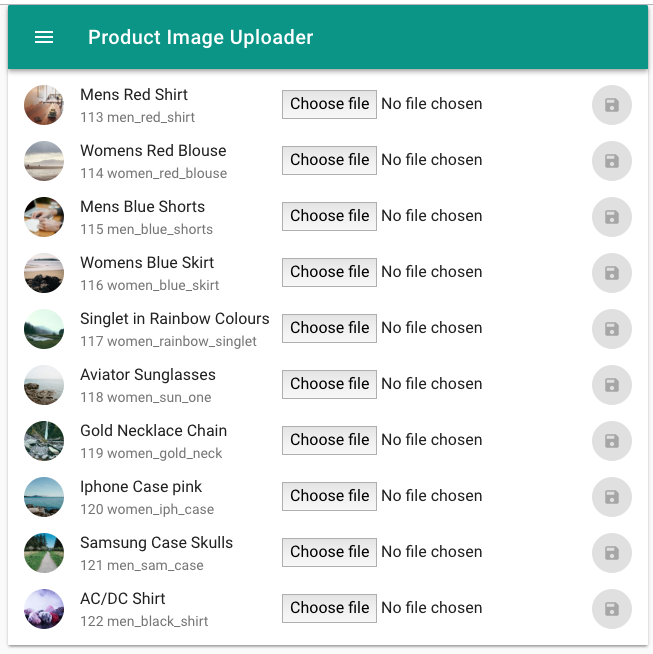

# MindArc Junior Backend Assessment

Setup
---

1. Clone this repo.
1. `config.php` stores all the database configurations. Please correct it first. 
1. If the database does not exist, use `create_database.sql` to seed the database. This will create
an empty database.
1. To serve `image-uploader.php`. Go into the repo directory. Run `php -S localhost:8888`
1. Go to the browser on `localhost:8888/image-uploader.php`

Introductions
---
Thanks for taking the time to complete this backend technical assessment. We will be focusing on code quality (reusability, readability, maintainability, etc). You will be required to create a series of PHP functions within scripts and the creation of a MySQL Database containing 2 tables.

Estimated Time: 3h

Exercise
---
Create a database (`mindarc_assessment`) using best practices for character encoding that contains 2 tables (`original_data`, `migrated_data`).

`original_data`  
<table style="undefined;table-layout: fixed; width: 303px">
<colgroup>
<col style="width: 151px">
<col style="width: 152px">
</colgroup>
  <tr>
    <td>product_id</td>
    <td>PK</td>
  </tr>
  <tr>
    <td>product_code</td>
    <td>var_char(50) not_null</td>
  </tr>
  <tr>
    <td>product_label</td>
    <td>var_char(255) not_null</td>
  </tr>
  <tr>
    <td>gender</td>
    <td>var_char(255)</td>
  </tr>
</table>

`migrated_data`  
<table style="undefined;table-layout: fixed; width: 303px">
<colgroup>
<col style="width: 151px">
<col style="width: 152px">
</colgroup>
  <tr>
    <td>product_id</td>
    <td>PK</td>
  </tr>
  <tr>
    <td>sku</td>
    <td>var_char(50) not_null</td>
  </tr>
  <tr>
    <td>name</td>
    <td>var_char(255) not_null</td>
  </tr>
  <tr>
    <td>image_url</td>
    <td>var_char(255)</td>
  </tr>
</table>

Using the data sample csv provided in this repository, and using PHP, create a script (pop-table.php) that populates the original_data table.

Write a second script (migrate.php) that takes the data from the `original_data` table, transforming the data and storing it in to the `migrated_data` table

When transforming the data, the following rules apply:
- `migrated_data`.sku = `original_data`.product_code
- `original_data`.product_label = `migrated_data`.name
- When creating the sku in the `migrated_data` table add the gender as a suffix to the product_code seperated by an underscrore (\_\). Where gender is 'F', it should be converted to 'women' and 'M' will be converted to 'men'. By default, the value should be 'women'.

Lastly, write a simple html form (image-uploader.php), that lets a user upload a image to a specific row in the `migrated_data` table. Store the image in a subdirectory within your project called `media` and store the relative path to the image in to the `migrated_data`.`image_url` field.

NOTE: Please source your images from https://picsum.photos/

Lastly, create a MySQL Dump of the final database and provide it as a sql script within your project (exercise_dump.sql).

Final Deliverables
---
On completion, you should be able to provide an archive (<your_name>\_\<date>.tar.gz) with the following:
- exercise_dump.sql
- pop-table.php
- migrate.php
- image-uploader.php
- media (directory with sample images inside)

Feel free to provide an archive with these deliverables, or if you prefer, fork this branch on github and push your changes as a feature branch using the same naming convention as required for the archive.
